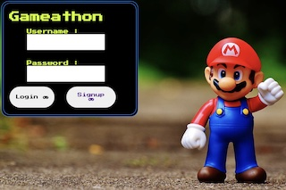

# Gameathon

## Badges
  

  ## Table of Contents
  * [License](#license)
  * [Description](#description)
  * [Installation](#Installation)
  * [Walk Through](#walkthrough)
  * [Heroku Link](#Herokulink)
  * [Usage](#usage)
  * [Questions](#questions)

  ## License
  Read more about ISC here:
  [ISC] (https://opensource.org/licenses/ISC)

  ## Description
 Calling all old school gamers! If you ever wanted to relive your memories when you were a kid; going down the track of Toad’s turnpike (Mario Kart 64), throwing down banana peels, or being a stone cold killer, in a movie turned video game goldeneye 007(MGM )this website is for you! 

 ## Installation
- npm init -y
- npm i
- npm install express
- npm i sequelize mysql2
- npm install dotenv --save
- sudo npm install -g nodemon

  ## Walk Through

  [Walk Through](https://drive.google.com/file/d/1beA7Lco_CrbnykOZ4iM8HLX9naNAFF2v/view)

  ## Usage
  As a game developer and researcher, I want to know why old school games were popular, in order to attract an older generation of gamers, and hopefully to target a new audience! 

  

  ## Presentation Link
  [Gameathon Presentation](https://docs.google.com/presentation/d/1bXO76XeOP-JmaQg6Jdu-WqvPgjAaGjWM_qpLgHWRlA8/edit#slide=id.g29f43f0a72_0_0)

  ## Heroku Link
  [Heroku link](https://wegameathon.herokuapp.com/games)

  ## Questions?
  ### Reach us here: 
  * [rimadas9878](https://github.com/rimadas9878)
  * [iTeak](https://github.com/iTeak)
  * [claire-max](https://github.com/claire-max)
  * [Everyone1138](https://github.com/Everyone1138)
  